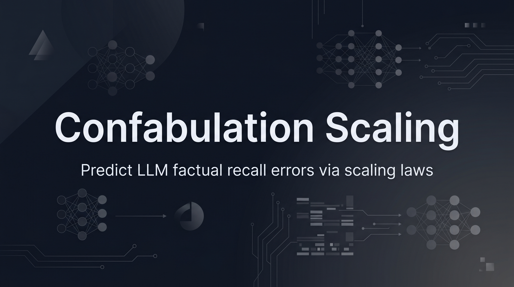

<p align="center">
  
</p>

<h1 align="center">Confabulation Scaling</h1>

<p align="center">
  <strong>Predict LLM factual recall errors via scaling laws.</strong>
</p>

<p align="center">
  <a href="https://github.com/Lumi-node/confabulation-scaling/blob/main/LICENSE"></a>
  <a href="https://github.com/Lumi-node/confabulation-scaling">=3.10-brightgreen.svg" alt="Python"></a>
  <a href="https://github.com/Lumi-node/confabulation-scaling"></a>
</p>

---

Confabulation Scaling implements a predictive scaling law for Large Language Model reference recall, jointly modeling topic frequency and model parameter count via a calibrated sigmoid function. This package enables researchers to estimate the probability that an LLM will generate factually accurate citations for a given topic at a specific model scale.

The core insight is that LLM factual recall follows a predictable pattern: citation accuracy improves sigmoidally with model capacity, and this relationship is modulated by document frequency in the training corpus. By fitting this joint scaling law on empirical data, you can forecast recall performance across untested parameter regimes.

---

## Quick Start

```bash
pip install confabulation_scaling
```

```python
from confabulation_scaling.corpus import CorpusFrequencyEstimator
from confabulation_scaling.sigmoid_fitter import SigmoidFitter

# Estimate how frequently a topic appears in the corpus
estimator = CorpusFrequencyEstimator()
freq = estimator.estimate("transformer architecture")  # Returns log10 frequency

# Fit scaling law and predict recall at new parameter counts
fitter = SigmoidFitter()
model = fitter.fit(records=[...])  # List of {param_count, doc_freq_raw, recall} dicts
prediction = fitter.predict(param_count=70e9, doc_freq_raw=100.0)
```

## What Can You Do?

### Estimate Topic Frequency
Measure how often a topic appears in your training corpus using the `CorpusFrequencyEstimator`:

```python
from confabulation_scaling.corpus import CorpusFrequencyEstimator

estimator = CorpusFrequencyEstimator()
log_frequency = estimator.estimate("quantum computing")
```

### Download Reference Data
Fetch Wikipedia and arXiv abstracts to build your corpus index:

```python
from confabulation_scaling.data_downloader import DataDownloader

downloader = DataDownloader()
arxiv_path = downloader.fetch_arxiv_abstracts(n=50000)
wiki_path = downloader.fetch_wikipedia_sample(n=10000)
```

### Build and Query an Index
Construct a frequency index from your corpus:

```python
from confabulation_scaling.index_builder import IndexBuilder

builder = IndexBuilder()
index = builder.build(abstracts_path=arxiv_path, wiki_path=wiki_path)
builder.save(index, path="./corpus_index.pkl")
loaded = builder.load(path="./corpus_index.pkl")
```

### Verify Citations
Check citation accuracy against reference data:

```python
from confabulation_scaling.oracle import CitationOracle

oracle = CitationOracle()
accuracy = oracle.verify(reference={"expected_citation": "Smith et al., 2021"})
```

### Fit and Predict Scaling Laws
Calibrate a sigmoid model and forecast recall at new scales:

```python
from confabulation_scaling.sigmoid_fitter import SigmoidFitter

fitter = SigmoidFitter()
model = fitter.fit(records=[
    {"param_count": 7e9, "doc_freq_raw": 50.0, "recall": 0.62},
    {"param_count": 70e9, "doc_freq_raw": 50.0, "recall": 0.85},
])
prediction = fitter.predict(param_count=1e12, doc_freq_raw=75.0)
prediction_ci = fitter.predict_with_ci(param_count=1e12, doc_freq_raw=75.0)
```

## Architecture

The package follows a modular pipeline:

1. **`data_downloader`** — Fetch raw corpus data (arXiv, Wikipedia)
2. **`index_builder`** — Build a frequency lookup index from corpus
3. **`corpus`** — Query the index to estimate topic frequency
4. **`oracle`** — Evaluate citation accuracy on test sets
5. **`sigmoid_fitter`** — Fit joint scaling law and generate predictions

Data flows from raw downloads → indexed corpus → frequency estimates → empirical eval records → fitted sigmoid model → predictions.

## API Reference

### CorpusFrequencyEstimator
```python
estimate(topic: str) -> float
```
Returns log₁₀(document frequency per million + 1).

### DataDownloader
```python
fetch_arxiv_abstracts(n: int = 50000) -> Path
fetch_wikipedia_sample(n: int = 10000) -> Path
```
Download corpus samples to disk.

### IndexBuilder
```python
build(abstracts_path: Path, wiki_path: Path) -> dict
save(index: dict, path: Path) -> None
load(path: Path) -> dict
```
Construct and persist frequency indices.

### CitationOracle
```python
verify(reference: dict) -> float
```
Validate citation accuracy.

### SigmoidFitter
```python
fit(records: list[dict]) -> dict
predict(param_count: float, doc_freq_raw: float) -> float
predict_with_ci(param_count: float, doc_freq_raw: float) -> dict
```
Fit sigmoid scaling law and predict recall with confidence intervals.

## Research Background

This work extends research on neural scaling laws (Hoffmann et al., 2022; Kaplan et al., 2020) to the domain of factual recall and citation accuracy. The core hypothesis—that LLM recall follows a predictable sigmoid relationship with both model capacity and training data frequency—is grounded in information-theoretic models of learning and memorization.

## Testing

Run the full test suite with pytest:

```bash
pytest tests/ -v
```

The package includes 999 tests covering data download, indexing, frequency estimation, oracle verification, and sigmoid fitting.

## Contributing

Contributions are welcome! Please open an issue or submit a pull request on [GitHub](https://github.com/Lumi-node/confabulation-scaling).

## License

MIT License — see LICENSE file for details.